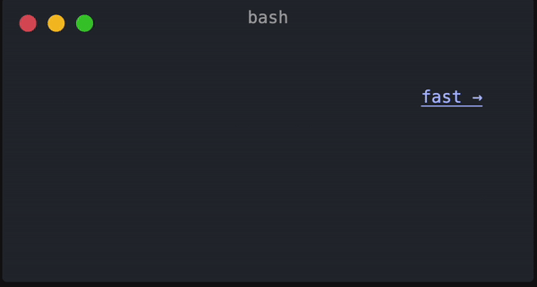

___

# Sphinx Termynal


[](https://codecov.io/gh/prajeeshag/sphinx-termynal)


**Documentation**: [https://prajeesh-ag.com/sphinx-termynal](https://prajeesh-ag.com/sphinx-termynal/)

___




Create animated terminal window in your [Sphinx](https://www.sphinx-doc.org) documentation.

## Installation

```console
pip install sphinx-termynal
```

## Usage

1. **Add the extension to `conf.py`:**

   ```python
   extensions = [
       ...
       "sphinx_termynal",
       ...
   ]
   
2. **Use the extension in your documentation:**
You can now use it in your .rst files. For example:

```rst
.. termynal:: 
   $ pip install sphinx-termynal
   -->
   sphinx-termynal installed

```
This will produce the following terminal animation:


For more examples check the [Documentation](https://prajeesh-ag.com/sphinx-termynal/) 

## Credits

Thanks [ines](https://github.com/ines/termynal), [termynal.py](https://github.com/termynal/termynal.py)
